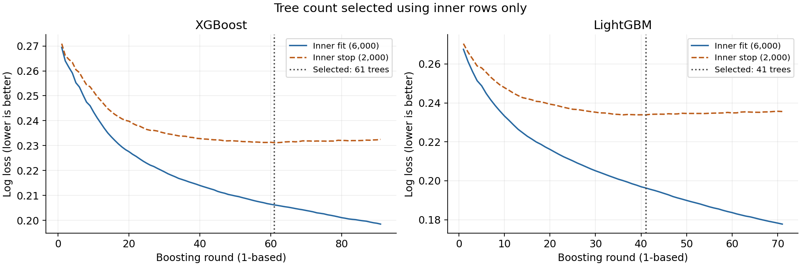
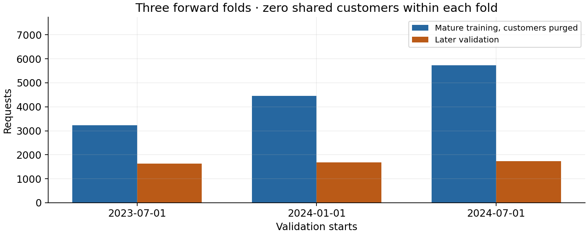
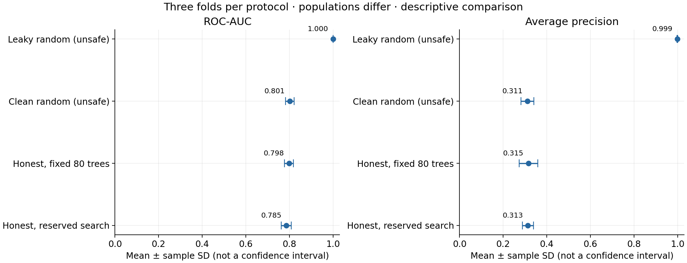
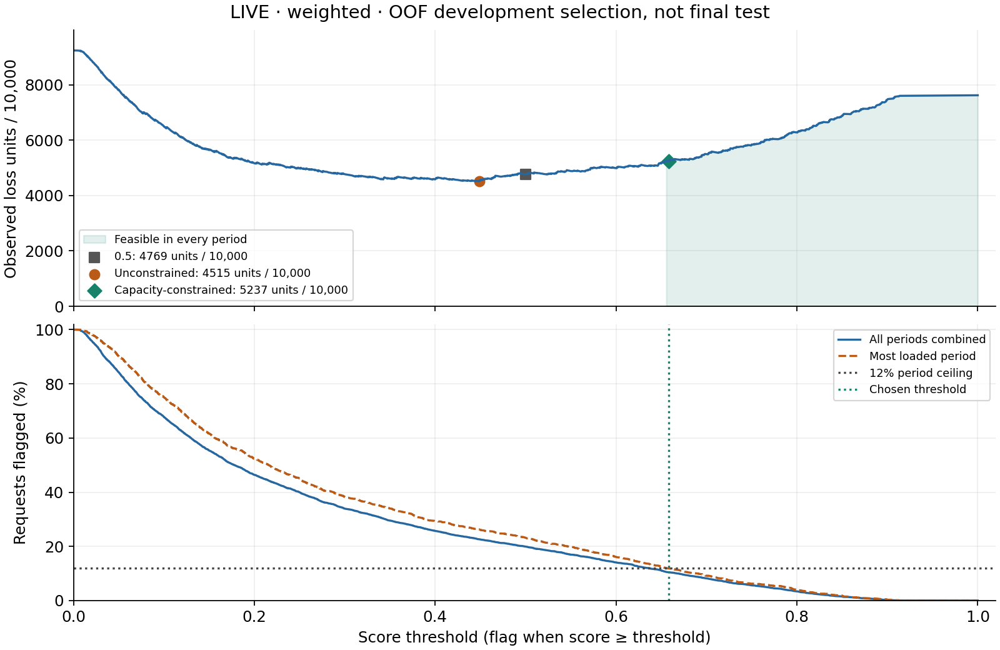
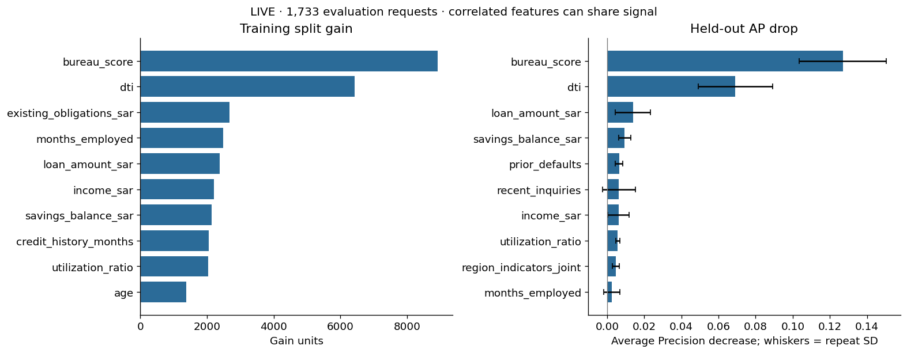
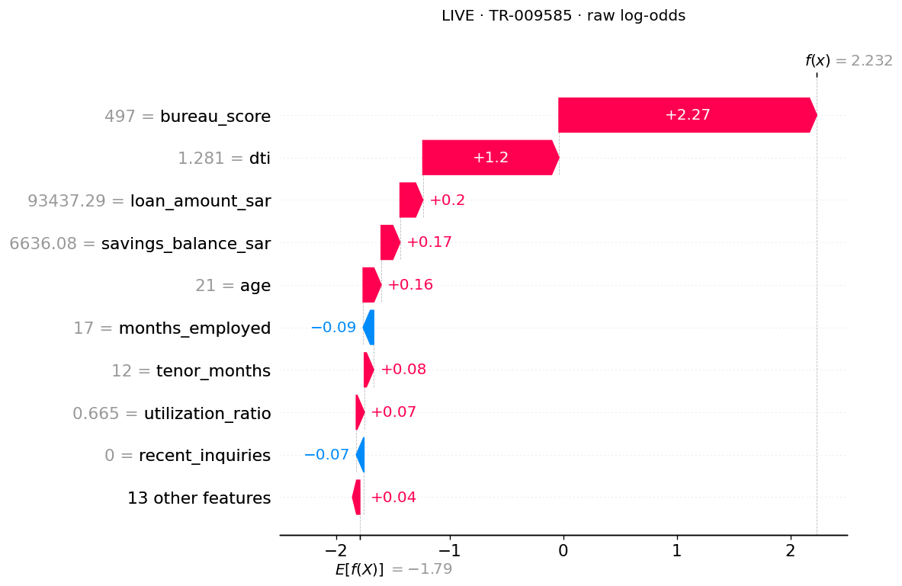
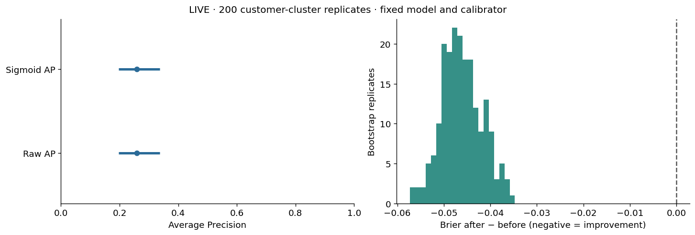
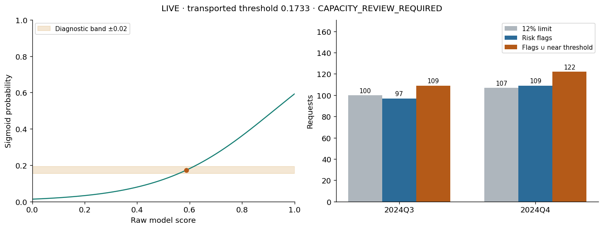

<!-- SIMPLIFIED_SUBMISSION_OVERVIEW -->
# Tamweel Lite — SDA-DSC-211

**Student account:** Daliaalmaai. **Student code:** 211. The official code supplied by the learner is 211; the repository is named SDA-DSC-211-211.

## Assessment entry point | ملف الأكواد الجامع

[FINAL_CODE_NOTEBOOK.ipynb](FINAL_CODE_NOTEBOOK.ipynb) assembles readiness, Days 1–5 and the final technical check. The separate daily notebooks retain their individual results. Use a fresh free CPU Colab session and **Runtime → Run all**; download the executed `.ipynb` and upload it manually. No Drive mount or GitHub authorization is required.

## Project and results | الفكرة والنتائج

Tamweel Lite estimates synthetic 90-day default risk to prioritize educational human review. It compares Logistic Regression, XGBoost and LightGBM; uses time-ordered customer-separated validation, Optuna, class weighting/oversampling, cost and capacity policies, permutation importance, SHAP, calibration, averaging and stacking. Tools: Python, pandas, NumPy, scikit-learn, LightGBM, XGBoost, Optuna, SHAP and matplotlib; pinned versions are in `requirements-colab.txt`, `constraints.txt` and `artifacts/environment.json`.

The final choice is **KEEP SINGLE: Logistic Regression**. Its Day 5 mean outer-fold AP is **0.39166**, versus **0.38942** for learned weighted averaging; the ensemble acceptance rule was not met. These are development results, not challenge test performance.

The raw OOF decision threshold is **0.16892161427109176**, transported through the fitted sigmoid to **0.12225843144286948**. The policy uses **10 × FN + FP** and a **12% batch capacity**. The unlabelled challenge contains 2,500 requests: 330 exceed the threshold and the full-batch cap retains 300 review flags. A review flag is not an automatic credit rejection.

Limitations: synthetic data; three related temporal folds; threshold/model selection uses development OOF; challenge labels are unavailable; calibration fit Brier/ECE worsened and do not establish independent benefit; regional gaps are descriptive and do not certify fairness. Day 4 SHAP explains its LightGBM model, not the final Logistic model. The Day 4 capacity-band finding is retained transparently; the final Day 5 batch policy applies its own cap.

## Required submission files | ملفات التسليم

- [Readiness](notebooks/00_readiness_check.ipynb), [Day 1](notebooks/01_baseline_boosting.ipynb), [Day 2](notebooks/02_validation_tuning.ipynb), [Day 3](notebooks/03_cost_sensitive_decision.ipynb), [Day 4](notebooks/04_explain_calibrate.ipynb), [Day 5](notebooks/05_final_model.ipynb), [Final check](notebooks/99_final_submission_check.ipynb).
- [Decision Card](reports/DECISION_CARD.md), [Interpretability Report](reports/INTERPRETABILITY_REPORT.md), [Model Card](reports/MODEL_CARD.md), [Ensemble Decision](reports/ENSEMBLE_DECISION.md).
- [submission.csv](submission/submission.csv), [five-slide final presentation PDF](presentation/final_presentation.pdf), [portable inference](tamweel/inference.py).

The instructor's simplified notice permits clear folders and requires one public repository. It does not require a template, tag or commit SHA. Historical tags remain as reproducibility references. Technical checks are evidence of execution, not an automatic grade; the written reasoning and oral defence require human assessment. Data are synthetic; no private customer data or credentials are needed.

---

<!-- BILINGUAL:EN -->

# Tamweel Lite — Financing Default Risk

An educational machine learning project for estimating the probability
of default within 90 days after a financing application, using information
available at application time.

**Course:** SDA-DSC-211 — Advanced Machine Learning Methods  
**Project type:** Individual learner project  
**Current stage:** Days 1–5 executed and evidence saved; official Notebook 99 final preflight passed  
**Day 1 initial candidate:** XGBoost, provisional; Day 2 evaluates LightGBM protocols

> This project uses synthetic course data. It must not be used to make
> real financing decisions. This is a learner repository, not an official
> SDAIA repository.

[Executed Day 1 notebook](notebooks/01_baseline_boosting.ipynb) ·
[Model comparison](artifacts/day1_model_comparison.csv) ·
[Written decision](artifacts/day1_reflection.json)

## Quick Navigation | التنقل السريع

- [Day 1 notebook | دفتر اليوم الأول](notebooks/01_baseline_boosting.ipynb)
- [Day 2 notebook | دفتر اليوم الثاني](notebooks/02_validation_tuning.ipynb)
- [Day 2 results | نتائج اليوم الثاني](artifacts/validation_summary.csv)
- [Day 2 reflection | تفسير اليوم الثاني](artifacts/day2_reflection.json)
- [Day 3 notebook | دفتر اليوم الثالث](notebooks/03_cost_sensitive_decision.ipynb)
- [Decision Card | بطاقة القرار](reports/DECISION_CARD.md)
- [Day 4 notebook | دفتر اليوم الرابع](notebooks/04_explain_calibrate.ipynb)
- [Interpretability Report | تقرير التفسير والمعايرة](reports/INTERPRETABILITY_REPORT.md)
- [Project progress | تقدم المشروع](#project-progress)

<!-- BILINGUAL:AR -->

مشروع تعليمي لتقدير احتمال التعثر خلال 90 يومًا باستخدام معلومات وقت تقديم الطلب.
اكتملت دفاتر وأدلة الأيام الخمسة، والنموذج النهائي وملف التنبؤات والعرض. اجتازت النسخة السابقة الفحص التقني الكامل، ويُعاد فحص النسخة المحدثة. نتيجة اليوم الرابع تحتاج مراجعة السعة. البيانات اصطناعية والنتائج لا تصلح
لاتخاذ قرارات تمويل حقيقية. تُحفظ دفاتر الأيام وأدلتها في مستودع واحد، ثم يُنتج
النموذج وواجهة التنبؤ النهائية في اليوم الخامس.

## Project Overview

The project investigates whether machine learning models can estimate
90-day default risk from application-time features.

The five-day workflow progressively adds validation, decision analysis,
interpretation, calibration, and final documentation.

Day 1 establishes a reproducible baseline and compares Logistic Regression,
XGBoost, and LightGBM. The objective is to select an initial candidate
using evidence rather than model complexity or reputation.

## Project Progress

| Stage | Focus | Status |
|---|---|---|
| Readiness | Environment and data checks | Completed |
| Day 1 | Baseline and boosting comparison | Completed |
| Day 2 | Customer-aware and time-aware validation; tuning | Completed |
| Day 3 | Class imbalance and decision costs | Executed; evidence and Decision Card saved |
| Day 4 | Interpretation and calibration | Executed LIVE; report saved; capacity review required |
| Day 5 | Ensembles, Model Card, and final delivery | Live outputs saved; Notebook 99 final preflight passed |

## Dataset and Prediction Task

All records are synthetic.

| Item | Value |
|---|---|
| Training applications | 10,000 |
| Model predictors | 22 |
| Target | `default_within_90d` |
| Overall default prevalence | 7.89% |
| Missing feature cells | 766 |
| Prediction time | At application submission |

The target records whether a default event occurs within 90 days after
the application. It does not mean a delay of exactly 90 days.

Identifiers, dates, split-control columns, and the target are excluded
from model inputs. Challenge data is not used in the Day 1 comparison.

## Day 1 Technical Pipeline

1. Prepare the free CPU environment and verify pinned course files.
2. Load and inspect the synthetic training data.
3. Separate development, internal selection, and comparison roles.
4. Fit a Logistic Regression baseline using a preprocessing pipeline.
5. Select boosting tree counts using inner-stop log loss.
6. Refit the boosting models on all development rows.
7. Evaluate all three models on the same comparison rows.
8. Export predictions, metrics, figures, split membership, and reflection.

### Data Roles

| Role | Applications | Purpose |
|---|---:|---|
| Inner fit | 6,000 | Fit preprocessing and trees during tree-count selection |
| Inner stop | 2,000 | Select the tree count using log loss |
| Development | 8,000 | Fit or refit models after internal decisions are fixed |
| Comparison | 2,000 | Evaluate the fitted models |

Inner fit and inner stop are subsets of development, not additional data.
The comparison set is not used for early stopping or tree-count selection.

### Baseline and Boosting

The Logistic Regression baseline uses median imputation, feature scaling,
and classification in a single pipeline. Learned preprocessing values
come from development rows only.

For boosting, tree-count selection uses the internal split, followed by
refitting on all development rows.

| Model | Selected trees | Evaluated rounds |
|---|---:|---:|
| XGBoost | 61 | 91 |
| LightGBM | 41 | 71 |

Neither model reached the 300-tree search ceiling.

## Key Results — Day 1

Evaluation used 2,000 comparison applications, including 158 defaults
(7.9% prevalence).

| Model | ROC-AUC | Average Precision | Training time (s) | Selected trees |
|---|---:|---:|---:|---:|
| Logistic Regression | **0.8213** | 0.3258 | **0.0386** | Not applicable |
| XGBoost | 0.8124 | **0.3338** | 0.3610 | 61 |
| LightGBM | 0.8138 | 0.3248 | 0.2556 | 41 |

Training time includes tree-count selection and refitting for boosting,
and fitting for Logistic Regression. Download and plotting time are
excluded. These timings describe this run, not a hardware guarantee.

In this course, PR-AUC refers to scikit-learn Average Precision,
not trapezoidal integration of the precision–recall curve.

[Full comparison table](artifacts/day1_model_comparison.csv) ·
[Comparison predictions](artifacts/day1_comparison_predictions.csv)

## Initial Model-Selection Decision

XGBoost was selected as an initial candidate because it achieved the
highest Average Precision: 0.3338 versus 0.3258 for Logistic Regression.

The improvement was modest at 0.0080. Logistic Regression was faster
and achieved a higher ROC-AUC, making it a strong competing baseline.

This selection is provisional. If XGBoost's AP advantage disappears
under customer-aware and time-aware validation, Logistic Regression
may be preferred for its simplicity and faster training.

## Visual Evidence

### Learning Curves

Training loss continued to decline after inner-stop loss stopped
improving. Tree counts were selected using the internal rows only.



### ROC and Precision–Recall

The curves are close and intersect. No model dominates across all
operating points. The precision reference line represents the
comparison prevalence of 7.9%.


## Day 1 Interpretation and Limitations

- Accuracy alone is unsuitable as the headline metric: predicting
  non-default for every application would achieve approximately 92%
  accuracy while detecting no defaults.
- AP is considered alongside ROC-AUC because defaults are uncommon.
- There are 1,226 customers shared between development and comparison.
- The random split does not fully address customer overlap, temporal
  leakage, or target-maturity boundaries.
- This single split provides no confidence interval and does not
  establish general model superiority.
- These results do not establish probability calibration or operational
  financing value.
- Day 1 does not select a final approval, review, or rejection threshold.

## Day 1 Reproducibility

| Setting | Value |
|---|---|
| Runtime | Google Colab, free CPU |
| Python | 3.13.16 |
| Seed | 211 |
| CPU threads | 2 |
| Mode | `FAST_MODE=True` |
| Maximum boosting trees | 300 |
| Early-stopping patience | 30 |
| Learning rate | 0.05 |
| XGBoost depth | 3 |
| LightGBM leaves | 15 |
| LightGBM minimum child samples | 50 |

Package versions are recorded in
[environment.json](artifacts/environment.json).

Run configuration, file hashes, selection curves, and split summaries
are recorded in [day1_run.json](artifacts/day1_run.json).

### Run the Day 1 Notebook

1. Open [the executed notebook](notebooks/01_baseline_boosting.ipynb).
2. Open it in Google Colab and save a personal copy before editing.
3. Select the free CPU runtime.
4. Execute cells sequentially, waiting for each cell to finish.
5. Complete the learner reflection using the new run's evidence.
6. Run the export cell and download the evidence files.

No paid subscription, GPU, API key, or Google Drive mount is required.

If the runtime restarts, rerun the prerequisite cells in order.
Training times may change between runs; update the reflection to match
the exported comparison table.

## Day 2 — Honest Validation and Bounded Tuning

Day 2 audits information availability and evaluates later applications from
customers excluded from the corresponding training fold. All four protocols
use LightGBM; this is not a new comparison of the three Day 1 model families.
The provisional Day 1 XGBoost choice therefore remains unconfirmed.

### Leakage and Duplicate Audit

The audit excluded `days_past_due_60` and `collection_calls` from model inputs
because their information is available after application time. Identifiers,
dates and the target retain their audit/split/label roles and are not predictors.
There were 10,000 input and retained applications, zero duplicate rows removed,
and 22 eligible predictors.

### Time, Customer and Label-Maturity Boundaries

Training requires `application_date + 90 days < validation_start`.
Labels maturing exactly at the boundary are excluded. Every validation
customer is removed from that fold's training data.

| Validation period | Training rows | Validation rows | Validation defaults | Shared customers |
|---|---:|---:|---:|---:|
| July–December 2023 | 3,223 | 1,632 | 110 | 0 |
| January–June 2024 | 4,460 | 1,674 | 135 | 0 |
| July–December 2024 | 5,731 | 1,733 | 139 | 0 |

The zero-overlap guarantee applies within each fold; a customer can occur in
more than one validation period. These are related periods, not independent tests.



### Reserved Search and Frozen Settings

A separate historical cohort contains 1,935 applications and 176 defaults
(9.10%). Its latest application is dated 2023-04-01. Its labels mature before
the first outer-validation period, and it excludes all outer-validation customers.

Optuna completed eight live trials across three internal forward folds in
approximately 2.75 seconds, stopping at the trial limit. The best internal
mean AP was 0.333269. Settings were frozen before outer performance was read:

| Selected setting | Value |
|---|---:|
| `learning_rate` | 0.08530488562858765 |
| `num_leaves` | 31 |
| `min_child_samples` | 40 |

Internal early stopping uses inner-stop log loss to select tree count;
preprocessing and trees are learned on inner-fit rows first, followed by
refitting on the complete fold-training rows. Outer validation does not select
imputation, tree counts or hyperparameters. The internal search AP is a
selection statistic, not an estimate of outer or future performance.


### Day 2 Results and Interpretation

Values below are unweighted fold means ± sample SD (`ddof=1`), not pooled
OOF metrics, confidence intervals or significance tests.

| Protocol | Validation rows | ROC-AUC mean ± SD | AP mean ± SD |
|---|---:|---:|---:|
| Leaky random control (unsafe) | 10,000 | 0.9999 ± 0.0002 | 0.9988 ± 0.0014 |
| Clean random control (unsafe) | 10,000 | 0.8010 ± 0.0200 | 0.3110 ± 0.0293 |
| Honest fixed, 80 trees | 5,039 | 0.7976 ± 0.0206 | 0.3153 ± 0.0426 |
| Honest reserved search | 5,039 | 0.7855 ± 0.0232 | 0.3133 ± 0.0259 |

The leaky control deliberately uses post-outcome fields and all-row imputation.
Its AP exceeds clean random by 0.6879, demonstrating the risk of misleading
scores under that combined unsafe protocol. The clean random control still
mixes time and customers; neither random control is deployment evidence.

Clean random AP minus honest fixed AP is -0.0044: honest validation does not
necessarily produce a lower number. These protocols use different populations,
periods and training sizes, so gaps are descriptive, not isolated causal effects.

On the same outer folds, tuned AP was approximately 0.0020 below fixed AP,
and tuned ROC-AUC was also lower. AP sample SD was smaller after tuning,
but these three periods do not establish superior future stability. This run
provides no evidence that tuning improved outer mean performance; the search
was not repeated to optimize disappointing outer results. Tuned tree counts
were 24, 36 and 19, versus 80 fixed trees in each baseline fold.



### OOF Coverage and Limitations

Each honest scheme exports 5,039 live out-of-fold probabilities, covering
100% of eligible applications and 50.39% of all 10,000 rows. The 4,961 warm-up
applications have no OOF predictions and are not filled with training predictions.
Random-control predictions are not exported for later decision work.

The small search cohort and sparse positives in some internal folds limit the
search. Eight configurations do not establish a globally optimal model.
The forward folds estimate a specific later-period, unseen-customer scenario
on synthetic data. They are not an independent final test and do not establish
fairness, calibration or operational financing value.

### Run the Day 2 Notebook

1. Open [02_validation_tuning.ipynb](notebooks/02_validation_tuning.ipynb) in Colab and save a personal copy.
2. Select a fresh free-CPU session; run setup before importing libraries.
3. Execute the cells in order, inspect the audits, and retain frozen search settings.
4. Write the reflection from that run and execute the response and export cells.
5. Save the executed notebook and extract/upload actual evidence files.
6. Verify a clean `Run all` execution before final assessment.

Day 2 uses seed 211, two CPU threads, `FAST_MODE=True`, a 200-tree ceiling,
patience 20, at most eight trials, three internal search folds and a 120-second
cooperative search budget. FULL mode is optional. No paid service or Drive mount
is required. This run used live search, not precomputed recovery results.

`environment.json` is the latest exported environment record and is updated
by Day 4; day-specific configurations remain in each day's run metadata.
Course data revision: `fe0c0204e6076a7ac2139b7336485a097343fb8a`.
Day 2 support revision: `1e1da4acbee8941bef07245b259fb6c27ced4ad7`.
These course-tool revisions are not the learner's final submission commit SHA.

## Day 2 Evidence Map | أدلة اليوم الثاني

| Evidence | File |
|---|---|
| Executed notebook | [02_validation_tuning.ipynb](notebooks/02_validation_tuning.ipynb) |
| Leakage audit | [leakage_audit.csv](artifacts/leakage_audit.csv) |
| Outer-fold audit | [fold_audit.csv](artifacts/fold_audit.csv) |
| Live trial history | [optuna_results.csv](artifacts/optuna_results.csv) |
| Frozen settings and internal audits | [best_params.json](artifacts/best_params.json) |
| Per-fold validation metrics | [validation_report.csv](artifacts/validation_report.csv) |
| Fold mean and sample SD | [validation_summary.csv](artifacts/validation_summary.csv) |
| Honest OOF predictions | [day2_oof_predictions.csv](artifacts/day2_oof_predictions.csv) |
| Coverage and warm-up roles | [day2_oof_coverage.csv](artifacts/day2_oof_coverage.csv) |
| Prediction provenance | [day2_provenance.json](artifacts/day2_provenance.json) |
| Written interpretation | [day2_reflection.json](artifacts/day2_reflection.json) |
| Run metadata | [day2_run.json](artifacts/day2_run.json) |
| Fold-size figure | [day2_fold_sizes.png](artifacts/day2_fold_sizes.png) |
| Search figure | [day2_search.png](artifacts/day2_search.png) |
| Comparison figure | [day2_validation_comparison.png](artifacts/day2_validation_comparison.png) |
| Latest environment record | [environment.json](artifacts/environment.json) |

## Day 3 — Class Imbalance and Decision Costs | اليوم الثالث

The live CPU run compares unweighted, weighted and oversampled LightGBM on
5,039 pooled OOF applications. Weighted modeling was the declared strategy
for threshold selection. False-negative cost is 10 educational units,
false-positive cost is 1, and flags must stay within 12% of each period.

| Rule | Threshold | Flags | Recall | Precision | Loss units | Capacity feasible |
|---|---:|---:|---:|---:|---:|---|
| Default | 0.5000 | 1,005 | 0.5781 | 0.2209 | 2,403 | No |
| Minimum loss without capacity limit | 0.4486 | 1,141 | 0.6406 | 0.2156 | 2,275 | No |
| Minimum loss within every-period capacity | 0.6583 | 526 | 0.4089 | 0.2985 | 2,639 | Yes |

The exact saved rule is `score >= 0.6583471436014694`. It flags 137, 183 and
206 applications against period capacities of 195, 200 and 207. Meeting
capacity costs 236 more educational loss units than the default threshold
and reduces recall. These are simulated development results, not a final test.
Predicting no flags achieves 92.38% accuracy but misses all 384 defaults.

Regional FPR ranges from approximately 7.64% to 8.29%, a gap of 0.6484
percentage points. This descriptive audit does not establish fairness.
OOF coverage is 50.39% of all training rows and 100% of eligible rows.
Weighted scores are not established as calibrated probabilities; costs are
simplified, and future review capacity and outcomes may differ.

اكتمل تشغيل اليوم الثالث وحفظ نتائجه وبطاقة القرار. اختيرت عتبة تقارب
0.6583 لتلبية حد المراجعة البالغ 12% في كل فترة. تُرسل 526 حالة للمراجعة،
مع انخفاض استرجاع حالات التعثر وزيادة الخسارة التعليمية مقارنة بعتبة 0.5.
النتائج مبنية على بيانات اصطناعية وتنبؤات OOF للتطوير؛ لا تمثل اختبارًا
نهائيًا أو دليلًا على العدالة أو معايرة الاحتمالات.

- [Executed notebook](notebooks/03_cost_sensitive_decision.ipynb)
- [Decision Card](reports/DECISION_CARD.md)
- [Model comparison](artifacts/day3_model_comparison.csv)
- [Exact threshold and policy](artifacts/threshold_metrics.json)
- [Period capacity](artifacts/day3_period_capacity.csv)
- [Regional audit](artifacts/day3_region_audit.csv)
- [Cost sensitivity](artifacts/day3_cost_sensitivity.csv)
- [Written reflection](artifacts/day3_reflection.json)
- [Run metadata](artifacts/day3_run.json)



## Day 4 — Interpretation and Calibration | اليوم الرابع

The notebook completed a LIVE free-CPU run with 80 weighted LightGBM trees,
300 TreeSHAP requests, three permutation repeats and 200 paired customer-cluster
bootstrap replicates. Setup verified pinned files and packages. No educational
SHAP example or challenge data was used. All six reflection fields were filled;
`TECHNICAL_READY | READY_FOR_REVIEW` records completion, not a grade or deployment approval.

### Separate Data Roles

Customers are separated across roles, newer roles are reserved first, and fit
labels must mature strictly before 2023-07-01. Imputation and model fitting use
fit only; sigmoid learns on calibration only, and threshold selection uses policy only.
The model, calibrator and policy are frozen before evaluation.

| Role | Requests | Customers | Defaults | Application period |
|---|---:|---:|---:|---|
| Fit | 2,516 | 1,853 | 217 | Jan 2022–Apr 2023 |
| Calibration | 584 | 538 | 40 | Jul–Sep 2023 |
| Policy | 589 | 566 | 55 | Jan–Mar 2024 |
| Evaluation | 1,733 | 1,520 | 139 | Jul–Dec 2024 |

The remaining 4,578 requests are excluded gaps or customer conflicts.
Evaluation was exposed earlier in the course and is not a final untouched test.

### Explanation Evidence

Held-out permutation AP drops were 0.1270 for `bureau_score` (repeat SD 0.0235)
and 0.0690 for `dti` (SD 0.0200), using all 1,733 evaluation requests. Region
indicators were shuffled jointly. Repeat SD is not a confidence interval;
correlated features can share signal.

On the 300-request SHAP sample, these same features had mean absolute contributions
of 0.9042 and 0.5437 **raw log-odds**, with training tree-path counts as background.
The maximum additivity error was 5.70e-15. Base plus summed contributions equals
the raw margin; sigmoid applies to the complete margin, not to separate contributions.
SHAP describes the raw weighted model and does not establish causality or fairness.

The highest raw-score sampled request, `TR-009585`, was selected without its outcome:
raw score 0.903079 and calibrated probability 0.479518. Its three positive reasons
were bureau score 497 (+2.269325), DTI 1.2806 (+1.198145), and financing amount
93,437.29 (+0.200725 log-odds). None of these values was imputed. Bureau score ±1
preserved the displayed probabilities and three reasons; this is a narrow local check.

### Calibration and Stability

| Metric on 1,733 evaluation requests (139 defaults) | Raw | Sigmoid |
|---|---:|---:|
| ROC-AUC | 0.770804 | 0.770804 |
| Average Precision | 0.258677 | 0.258677 |
| Brier score | 0.113027 | 0.067112 |
| Log loss | 0.357993 | 0.246749 |
| ECE, ten equal-width bins | 0.146871 | 0.022486 |

The increasing sigmoid mapping preserved ranking while improving measured
probability quality. ECE depends on bins and sample size, and sparse bins remain
weak evidence; improvement does not prove perfect calibration.

The 200 paired customer-cluster bootstrap replicates gave 95% percentile AP
intervals [0.197442, 0.337854] for both variants and a Brier-change interval
[-0.054177, -0.037409] (after minus before). Models remain fixed: these intervals
exclude training/calibrator fitting uncertainty and future drift, and do not
describe an individual's probability. Q3/Q4 AP was 0.27457/0.27050; quarter
variation is descriptive, not independent cross-validation.

### Review Capacity Finding

The raw policy threshold `0.5881953696965011` was selected under 10×FN+FP and
12% capacity on policy rows (68 flags, capacity 70, loss 387). Its transported
calibrated threshold is `0.17331013263107387`, with a predeclared diagnostic
band [0.15331013263107388, 0.19331013263107386]. This ±0.02 band is not a confidence interval.

| Evaluation period | Requests | 12% capacity, floored | Risk flags | Near threshold | Union for review |
|---|---:|---:|---:|---:|---:|
| 2024Q3 | 836 | 100 | 97 | 23 | 109 |
| 2024Q4 | 897 | 107 | 109 | 21 | 122 |

`CAPACITY_REVIEW_REQUIRED` is the preserved finding. The union counts each request
once and exceeds capacity by 9 and 15; Q4 risk flags alone exceed capacity by 2.
The threshold and ceiling were not changed after evaluation. A revised policy
requires new development and evaluation evidence.

اكتمل تشغيل SHAP والمعايرة مباشرة على CPU. تحسّن Brier وECE على 1733 طلب تقييم،
وبقي ترتيب النموذج كما هو. تجاوز اتحاد المراجعة السعة في الربعين؛ لذلك حفظنا
`CAPACITY_REVIEW_REQUIRED` دون تعديل العتبة بعد مشاهدة التقييم. البيانات اصطناعية،
والنتائج تفسير تعليمي وليست موافقة على تطبيق تمويلي حقيقي. صيغ التفسير بمساعدة
ChatGPT/Codex استنادًا إلى هذا التشغيل، ويجب أن تراجع المتدربة فهمها قبل التسليم.

### Day 4 Evidence

- [Executed notebook](notebooks/04_explain_calibrate.ipynb)
- [Interpretability Report](reports/INTERPRETABILITY_REPORT.md)
- [Complete 28-file evidence bundle](artifacts/day4_artifacts.zip)
- [Data roles](artifacts/day4_roles.csv), [prediction evidence](artifacts/day4_predictions.csv)
- [Permutation results](artifacts/permutation_importance.csv), [complete SHAP arrays](artifacts/shap_values_sample.npz)
- [Global SHAP](artifacts/day4_shap_global.csv), [SHAP metadata](artifacts/day4_shap_metadata.json)
- [Local reasons](artifacts/day4_reason_codes.csv), [local perturbations](artifacts/day4_local_stability.csv)
- [Calibration metrics and exact policy](artifacts/calibration_metrics.json), [reliability bins](artifacts/day4_reliability_bins.csv)
- [Period metrics](artifacts/day4_period_metrics.csv), [bootstrap replicates](artifacts/day4_bootstrap.csv), [stability summary](artifacts/day4_stability_summary.json)
- [Policy sweep](artifacts/day4_policy_sweep.csv), [review flags](artifacts/day4_review_flags.csv), [capacity audit](artifacts/day4_capacity.csv)
- [Model text](artifacts/day4_model.txt), [provenance](artifacts/day4_provenance.json)
- [Reflection](artifacts/day4_reflection.json), [run record](artifacts/day4_run.json), [environment](artifacts/environment.json)








To reproduce, open the Day 4 notebook in a fresh free-CPU Colab session, keep
FAST mode and live SHAP, run cells in order, review the new numbers, update the
reflection, then rerun export. Preserve the artifacts/reports structure and
save the executed notebook. Support revision: `4f6892d5c02923b5f8e3c78f4fcead73b043570f`.

## Remaining Work and Final Submission

Day 5 produced the final Logistic Regression model, inference interface, frozen policy, model card, ensemble decision, challenge predictions and five-slide PDF from live evidence. Final readiness requires clean notebook execution and Notebook 99
checks and consistent files/manifest,
and private submission through the cohort's approved channel. Tags and commit SHA are optional under the instructor's simplified submission notice. Daily readiness
messages are not final grades or submission receipts.


## Day 5 — Final model and delivery | اليوم الخامس

<!-- BILINGUAL:EN -->
The live nested-forward comparison chose **KEEP SINGLE: Logistic Regression**. The fit/selection pool contains 6,576 rows, with 836 calibration-only rows (78 positives). All six candidates share 2,155 outer OOF requests. Inner OOF alone learns ensemble weights and stacking coefficients, with customer separation and mature 90-day labels.

| Candidate | Mean AP | Fold SD | Mean Brier | Mean ECE |
|---|---:|---:|---:|---:|
| LightGBM | 0.34549 | 0.04348 | 0.06608 | 0.02311 |
| XGBoost | 0.35263 | 0.02904 | 0.06566 | 0.02276 |
| Logistic | **0.39166** | 0.02981 | 0.06327 | 0.01882 |
| Equal average | 0.37170 | 0.03258 | 0.06435 | 0.02038 |
| Weighted average | 0.38942 | 0.02906 | 0.06332 | 0.01772 |
| Stack | 0.38314 | 0.02949 | 0.06603 | 0.03106 |

No ensemble gained AP over Logistic or passed the fixed worth-it gate. Fold SD describes three dependent periods and is not a confidence interval. OOF is development selection evidence, not an untouched final test.

The raw OOF threshold **0.16892161427109176** flags 245/2,155 requests, with 84 TP, 161 FP and 95 FN. Educational loss is **1,111** under 10 FN + FP. Every period stays within 12% capacity (maximum 11.749%). Regional FPR ranges from 32/507 (eastern, 6.31%) to 50/486 (western, 10.29%), a descriptive gap of 3.976 percentage points without intervals or fairness certification.

The frozen sigmoid mapping transports the threshold to **0.12225843144286948**. Calibration-fit Brier worsened from 0.076473 to 0.078058 and ECE from 0.021121 to 0.034871. These are fit diagnostics on the calibrator's own rows; improvement is not claimed. Day 4 SHAP belongs to the earlier weighted LightGBM model and does not explain this final Logistic model.

All **2,500** challenge IDs appear once, in input order. One full-batch cap reduces **330** threshold candidates to **300** simulated review flags, removing 30. Equal-score blocks remain intact. Challenge labels are unavailable, so challenge AP, loss and FPR are not claimed. Saved-model replay matched probabilities within 1e-12 and decisions exactly.

<!-- BILINGUAL:AR -->
اختارت المقارنة الحية Logistic Regression مفرداً بمتوسط AP=0.39166؛ لم يجتز أي تجميع بوابة الجدوى. حوض التدريب والاختيار 6576 طلباً، وعينة المعايرة 836، والمقارنة على 2155 طلب OOF مع فصل العملاء ونضج الهدف. العتبة الخام 0.16892161427109176 أعطت 245 إشارة وخسارة تعليمية 1111 ضمن السعة بكل فترة. المعايرة ساءت في Brier وECE، ومقاييسها تشخيصات على بيانات تعلم المعاير. لا ننسب SHAP اليوم الرابع إلى Logistic النهائي. صُدرت 2500 حالة تحدٍّ، وخُفضت الإشارات من 330 إلى 300 بسقف 12% مرة واحدة؛ غياب التسميات يمنع ادعاء أداء التحدي أو عدالته.

- [Executed Day 5 notebook](notebooks/05_final_model.ipynb)
- [Model Card](reports/MODEL_CARD.md) and [Ensemble Decision](reports/ENSEMBLE_DECISION.md)
- [Final metrics](artifacts/final_metrics.json), [frozen policy](artifacts/final_policy.json) and [model manifest](artifacts/final_model/model_manifest.json)
- [Challenge submission](submission/submission.csv) and [five-slide presentation](presentation/final_presentation.pdf)
- [Earlier evidence](evidence/) and [Day 5 project bundle](submission/project_bundle.zip)


Reproduce saved predictions on the complete batch:

```bash
python scripts/replay_final.py
python scripts/rebuild_final.py
```

Codex assisted with execution, verification, interpretation drafting and the presentation. The learner must review and be able to defend the reasoning. Technical checks do not award a grade or acknowledge private submission.

## Repository Structure

```text
.
├── README.md
├── notebooks/       # Readiness and daily notebooks
├── artifacts/       # Metrics, predictions, figures, and run evidence
├── data/            # Synthetic course data and data contract
├── reports/         # Project report templates and completed reports
├── presentation/    # Presentation materials
├── submission/      # Final prediction and manifest files
├── tamweel/         # Project inference code
└── scripts/         # Setup, validation, and supporting utilities
```

## Day 1 Evidence Map

| Evidence | File |
|---|---|
| Executed notebook | [01_baseline_boosting.ipynb](notebooks/01_baseline_boosting.ipynb) |
| Model comparison | [day1_model_comparison.csv](artifacts/day1_model_comparison.csv) |
| Prediction evidence | [day1_comparison_predictions.csv](artifacts/day1_comparison_predictions.csv) |
| Split membership | [day1_split_membership.csv](artifacts/day1_split_membership.csv) |
| Learning curves | [day1_learning_curves.png](artifacts/day1_learning_curves.png) |
| ROC and precision–recall | [day1_roc_pr.png](artifacts/day1_roc_pr.png) |
| Written reflection | [day1_reflection.json](artifacts/day1_reflection.json) |
| Run metadata | [day1_run.json](artifacts/day1_run.json) |
| Environment | [environment.json](artifacts/environment.json) |

## References and Attribution

- Course: **SDA-DSC-211 — Advanced Machine Learning Methods**
- Course instructor: **Meaad Al-Marri**
- [Course template](https://github.com/almiyead-rgb/sda-dsc-211-student-template)
- [Day 1 guide](https://github.com/almiyead-rgb/sda-dsc-211-student-template/blob/main/DAY1_GUIDE.md)
- [Day 2 guide](https://github.com/almiyead-rgb/sda-dsc-211-student-template/blob/main/DAY2_GUIDE.md)
- [Administrative requirements](https://github.com/almiyead-rgb/sda-dsc-211-student-template/blob/main/ADMINISTRATIVE_REQUIREMENTS.md)
- [Technical requirements](https://github.com/almiyead-rgb/sda-dsc-211-student-template/blob/main/TECHNICAL_REQUIREMENTS.md)
- [Submission guide](https://github.com/almiyead-rgb/sda-dsc-211-student-template/blob/main/SUBMISSION_GUIDE.md)
- [Final-check guide](https://github.com/almiyead-rgb/sda-dsc-211-student-template/blob/main/FINAL_CHECK_GUIDE.md)
- [SDAIA Academy on GitHub](https://github.com/SDAIAAcademy)

The notebook and supporting code originate from the course template.
Results were produced through the learner's executed Colab run.

ChatGPT/Codex assistance was used to explain code and metrics, check
artifact consistency, and draft the reflection and README wording.


## Independent learner repository | مستودع المتدربة المستقل

<!-- BILINGUAL:EN -->
This independent repository preserves the course folder structure and credits the reused course code. It follows the instructor's direction, reported by the learner, to use an independent repository. The original repository remains available as the historical record. Template-release generation and exact blank-answer byte checks are not learner-assessment checks in this repository. CPU environment checks, unit tests, local links, bilingual documentation checks, and the course's final submission validation remain available. See [repository migration](docs/REPOSITORY_MIGRATION.md).

<!-- BILINGUAL:AR -->
هذا مستودع مستقل للمتدربة يحافظ على بنية مجلدات الدورة ويوثق مصدر الأكواد المعاد استخدامها. أُنشئ بناءً على توجيه الأستاذة الذي نقلته المتدربة. يبقى المستودع السابق سجلًا للمراحل الماضية. فحوص توليد إصدارات القالب ومطابقة الإجابات الفارغة لا تُشغّل بوصفها فحوص تقييم لهذا المستودع. تبقى فحوص البيئة والاختبارات والروابط والتوثيق باللغتين وأدوات فحص التسليم النهائي متاحة.

**Current status:** Executed notebooks and evidence for Days 1–5 are saved, including the Decision Card and Interpretability Report. Day 4 capacity review remains required. Day 5 live outputs are complete; official Notebook 99 final preflight passed all 100 checks; private submission remains pending. Passing a workflow is not a grade or final-readiness certification.


<!-- BILINGUAL:EN -->
The official Notebook 99 final assessment passed all 100 checks, including fresh isolated CPU execution of readiness and Days 1–5. The repository also provides a manually triggered **Final Project Check** workflow for the final commit. Technical readiness does not certify the written interpretation or award a grade. Review the AI-assisted reflections and presentation before private submission.

<!-- BILINGUAL:AR -->
نجح الفحص الرسمي في دفتر 99 في جميع الفحوص المئة، بما فيها إعادة تشغيل الاستعداد والأيام 1–5 في بيئات CPU مستقلة. يتوفر أيضًا فحص Final Project Check يدويًا على النسخة النهائية من المستودع. الجاهزية التقنية لا تثبت صحة التفسير ولا تمنح درجة؛ راجعي الإجابات والعرض المعدّين بمساعدة الذكاء الاصطناعي قبل التسليم الخاص.
